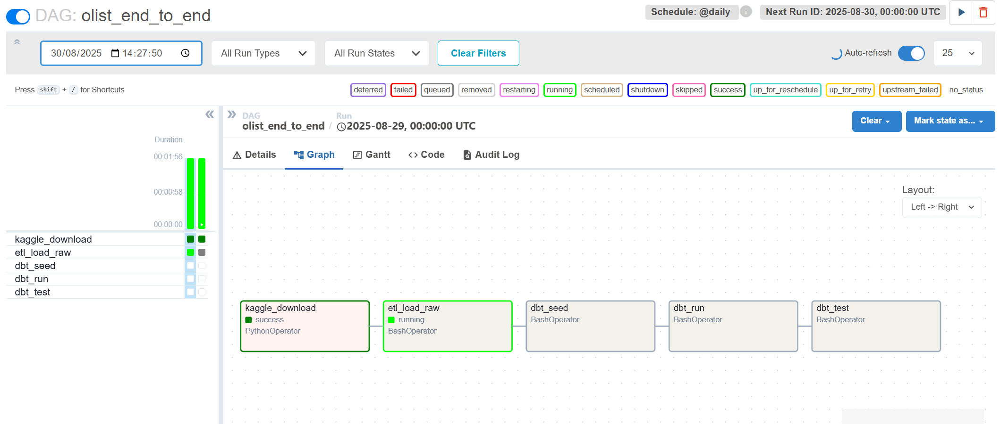
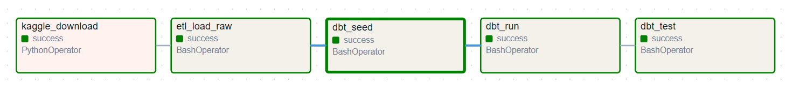
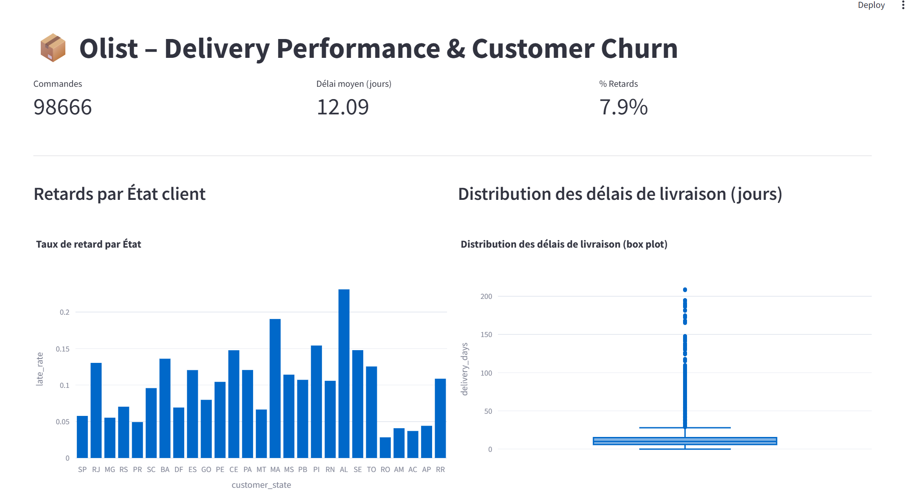
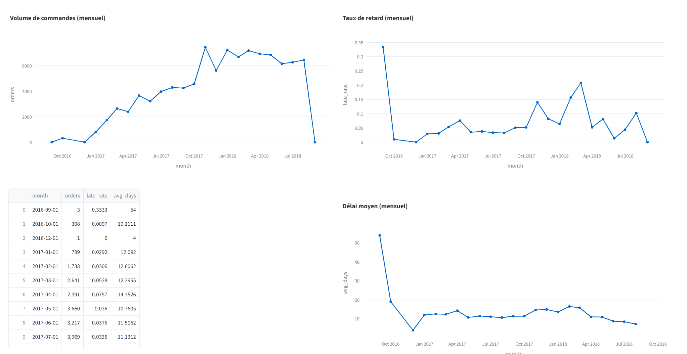

# Olist E-commerce — End-to-End Data Engineering Project

## Objectif

Mettre en place une pipeline analytique de bout en bout sur le dataset **Olist Brazilian E-commerce** :

- **Période couverte** : 2016 à 2018 
- **Volume** : environ 100 000 commandes 
- **Source** : Olist, la plus grande place de marché brésilienne, connectant des petites entreprises à différents canaux de vente. 
- **Objectif** : analyser la performance des ventes, des livraisons et la satisfaction client.

- Ingestion des CSV Kaggle → PostgreSQL (`raw.*`)  
- Transformation en modèle analytique via **dbt** (`staging.*`, `mart.*`)  
- Orchestration avec **Apache Airflow**  
- Visualisation des KPI avec une app **Streamlit**  


---

## Stack utilisée

- Python 3.10+ : Pandas, SQLAlchemy, psycopg2, dotenv  
- PostgreSQL 15 : entrepôt de données  
- dbt-core 1.8 : modélisation analytique  
- Apache Airflow 2.9 : orchestration des workflows  
- Streamlit + Plotly : dashboard interactif  
- Docker Compose : orchestration des services  

---

## 1. Pré-requis

Avant de lancer le projet, assurez-vous d’avoir installé :

1. **Docker Desktop** (Windows/Mac) ou **Docker Engine** (Linux)  
   [Télécharger Docker](https://docs.docker.com/get-docker/)

2. **Docker Compose v2** (inclus dans Docker Desktop récent)  
   Vérifiez avec :
   ```bash
   docker --version
   docker compose version

---

## 2. Lancer l’infrastructure

Démarrer les containers (Postgres + Airflow) :  

```bash
docker compose up -d --build
```

- PostgreSQL sera accessible sur **localhost:5433** (côté host).  
- Airflow Web UI sera disponible sur [http://localhost:8080](http://localhost:8080).  
 

---

## 3. Créer un utilisateur Airflow (admin)

Airflow ne crée pas d’utilisateur par défaut. Il faut créer un compte admin :  

```bash
docker exec -it olist_airflow bash -lc   'airflow users create     --username ${AIRFLOW_USERNAME}     --firstname ${AIRFLOW_FIRSTNAME}     --lastname ${AIRFLOW_LASTNAME}     --role ${AIRFLOW_ROLE}     --email ${AIRFLOW_EMAIL}     --password ${AIRFLOW_PASSWORD}'
```

Par défaut (variables `.env`) :  
- Login : `admin`  
- Password : `adminpwd`  
---

## 4. Orchestration avec Airflow

Dans l’UI Airflow :  
1. Activer le DAG **`olist_end_to_end`**  
2. Cliquer sur "Trigger DAG" pour l’exécuter  

Le DAG exécute les étapes suivantes :  
- Téléchargement Kaggle (données brutes → `data/`)  
- Ingestion des CSV dans Postgres (schéma `raw`)  
- **Transformations dbt** :  
  - Le schéma `staging` standardise les colonnes, nettoie les types et prépare les tables brutes pour analyse.  
  - Le schéma `mart` construit des tables analytiques (faits et dimensions) adaptées aux dashboards et aux KPI métiers.  

<p align="center">
  
  
</p>

---

---

## 5. Lancer l’application Streamlit

Lancer le dashboard localement (dans ton venv Python, pas dans Docker) :  

```bash
streamlit run app/streamlit_app.py
```

Accéder à l’UI : [http://localhost:8501](http://localhost:8501)  

Fonctionnalités incluses :  
- KPI globaux (commandes, clients, délais de livraison)  
- Boxplots des délais de livraison  
- Churn client (segmentation RFM)  
- Retards par État (barres horizontales)  

<p align="center">
  
  
</p>

---

## 6. Structure du projet

```
olist-ecommerce-endtoend/
├─ airflow/dags/          # DAGs Airflow
├─ etl/                   # Scripts Python ETL
├─ dbt/                   # Modèles dbt (staging + marts)
├─ app/streamlit_app.py   # Dashboard Streamlit
├─ data/                  # Données locales (Kaggle)
├─ docker-compose.yml
├─ requirements.txt
└─ .env
```

---

## Crédits

- Dataset : [Olist Brazilian E-Commerce Public Dataset](https://www.kaggle.com/datasets/olistbr/brazilian-ecommerce)  
- Réalisation : **Siham Bouzidi**  
- Stack : Python, PostgreSQL, dbt, Airflow, Streamlit, Docker  
